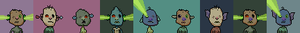

# Artbase Sandbox (& Cache) - Quick & Dirty "One-Off" Scripts To Download Complete Collections

Scripts, (token) metadata, images & more

## Collections - What's News?

<!-- punk style -->

**20×20px Marilyns**  - 14 max.  

**24×24px Bears**  - 5000 max.  
   
 [**bears.png**](https://github.com/pixelartexchange/collections/blob/master/bears/bears-24x24.png) (~1.23MB)

**24×24px (Binary) Apes** - 10 000 max. - formerly (Crypto) Binary Ape Yolo Club (BAYC)   
   
 [**binaryapes.png**](https://github.com/pixelartexchange/collections/blob/master/binaryapes/binaryapes-24x24.png) (~1.47MB)

**24×24px Punk Ape Pixel Club (PAPC)** - 5555 max.   
   
 [**punkapeclub.png**](https://github.com/pixelartexchange/collections/blob/master/punkapeclub/punkapeclub-24x24.png) (~886kb)

**24×24px Noun Punks** - 9969 max.  

**23×23px Pride Punks** - 9640 (?) max.  

<!-- 8-bit style -->

**24×24px Unemployables** - 5000 max.  

**24×24px 8-Bits** - 8888 max.   - also known as Eight Bit Me (Profile Pics)  
   
 [**8bits.png**](https://github.com/pixelartexchange/collections/blob/master/8bits/8bits-24x24.png) (~946kb)

**28×28px Galactic Aliens** - 10 000 max. -  also known as Galactic Alien Social Club  

<!-- moonbird style -->

**34×34px Moonbears** - 4000 max.  
    
 [**moonbears.png**](https://github.com/pixelartexchange/collections/blob/master/moonbears/moonbears-34x34.png) (~1.14MB)

**42×42px Moonquacks (Ducks)** - 3500 max.  
   
 [**moonquacks.png**](https://github.com/pixelartexchange/collections/blob/master/moonquacks/moonquacks-42x42.png) (~1.1MB)

**44×44px Moonstalkers (Cats)** - 6688 max.  
   
 [**moonstalkers.png**](https://github.com/pixelartexchange/collections/blob/master/moonstalkers-44x44.png) (~7.15MB)

**50×50px Moonbird x Punks** - 2469 max.   
    
 [**moonbirdpunks.png**](https://github.com/pixelartexchange/collections/blob/master/moonbirdpunks/moonbirdpunks-50x50.png) (~1.9MB)

**50×50px  Moonrunners (Wolfpack)** - 10 000 max.  
    
 [**moonrunners.png**](https://github.com/pixelartexchange/collections/blob/master/moonrunners/moonrunners-50x50.png) (~6.65MB)

**50×50px  Monke' Runners** - 6666 max.  
    
 [**monkerunners.png**](https://github.com/pixelartexchange/collections/blob/master/monkerunners/monkerunners-50x50.png) (~2.38MB)

**64×64px  Moonhunters (Cheetahs)** - 2200 max. - also known as Cheetah Coaltion   
    
 [**cheetahs.png**](https://github.com/pixelartexchange/collections/blob/master/cheetahs-64x64.png) (~2.72MB)

<!-- goblin style -->

**48×48px Goblin Town** - 4444 max.  
    
 [**goblintown.png**](https://github.com/pixelartexchange/collections/blob/master/goblintown/goblintown-48x48.png) (~1.24MB)

**50×50px  Moon Goblinz** - 6666 max.  

## Live Coding Session Transcripts

[**On Air Now! Live Art Base Coding Session - Let's Download the 10 000 Moonrunner Token Meta Data, Images, & More - Don't Get Left Out Of The Pack**](moonrunners)

[**On Air Now! Live Art Base Coding Session - Let's Download the 2222 Moonhunter Cheetah Token Meta Data, Images, & More**](moon-hunters)

[**On Air Now! Live Art Base Coding Session - Let's Download the 6666 Monkerunner Token Meta Data, Images, & More - Strong Together Don't Fall From The Branch [Into The Lava]**](monkerunners)

[**On Air Now! Live Art Base Coding Session - Let's Download the 3500 Moonquacks Token Meta Data, Images (Incl. 8 1/1s), & More - If It Looks Like A Duck, Swims Like A Duck, And Quacks Like A Duck...**](moonquacks)

## Questions? Comments?

Post them on the [D.I.Y. Punk (Pixel) Art reddit](https://old.reddit.com/r/DIYPunkArt). Thanks.

